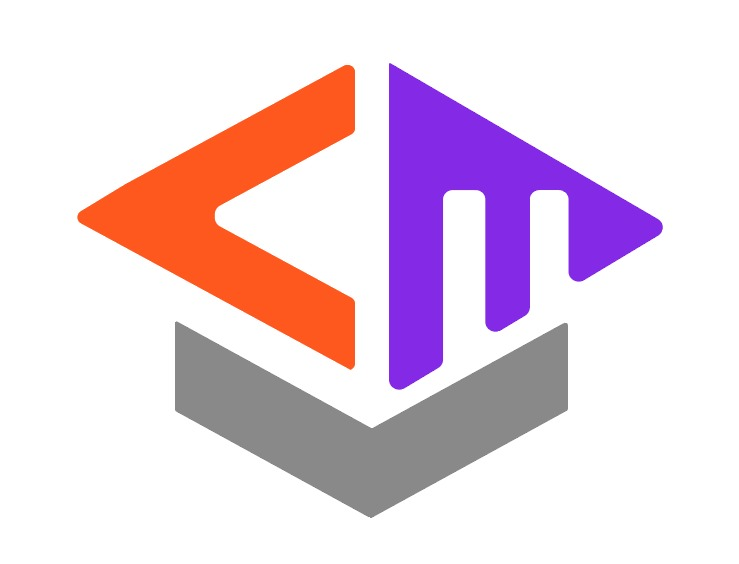

  

# CourseMate - Personalized Course Recommendation Platform

CourseMate is an innovative dashboard application designed to enhance the way learners discover and engage with online courses. By analyzing individual preferences, learning styles, and proficiency levels, it provides personalized course recommendations. The primary challenge it addresses is the difficulty learners face in navigating numerous online platforms to find courses that align with their needs and goals. 

As personalized learning experiences gain momentum, CourseMate simplifies the course selection process through machine learning models and scalable cloud infrastructure. By continuously learning from user feedback, the app improves its ability to suggest relevant courses, adapting to changing preferences over time. The application aims to empower learners by providing the right educational tools that efficiently meet their needs. CourseMate seeks to reduce information overload, streamlining the learning journey, and ultimately improving learning outcomes. By offering a smarter approach to course discovery, the app helps learners achieve their educational goals with ease and precision, ensuring that they receive the best-suited learning experiences.

## Team Members

**TEAM ID:** `C242-PR594`  
**TEMA:** `Empowering Minds: A holistic approach to education and personal development`
| Bangkit ID       |           Name            |   Learning Path    | Status |
|:----------------:|---------------------------|:------------------:|:---------------------------------|
| M640B4KY0793      | Bagus Angkasawan Sumantri Putra  | Machine Learning   | Active |
| M312B4KX3503      | Pratisia Tri Handayani | Machine Learning   | Active |
| C313B4KY0207      | Ahmad Ghifaril Afkar | Cloud Computing    | Active |
| C134B4KX0260      | Aisya Wulan Dari | Cloud Computing    | Active |
| C119B4KY1448      | Fauzan | Cloud Computing | Active |
| C172B4KY2351      | M. Natasya Ramadana | Cloud Computing | Active |
| A009B4KY2665      | Muhamad Syaiful Anwar | Mobile Development | Active |
